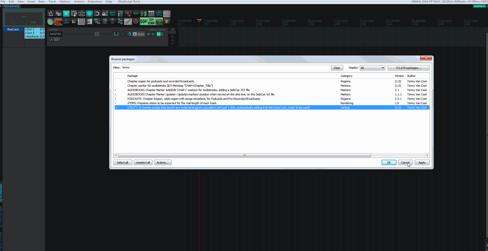

# Tormy Van Cool ReaPack Scripts

Scripts for Reaper
------------------
here you can find some script for Podcasting, Broadcasting and Music Production, helping to expedite some specific workflow.

Copy and paste the following link in Reaper:

_Extensions > ReaPack > Import repositories..._

* https://github.com/tormyvancool/TormyVanCool_ReaPack_Scripts/raw/master/index.xml

Warning
-------
To install the Podcast/Audiobook scripts, this library is mandatory. Please install it and activate it first.
* https://github.com/Ultraschall/ultraschall-lua-api-for-reaper/raw/master/ultraschall_api_index.xml

To activate it:

_Actions > Script: ultraschall_Add_Developertools_To_Reaper.lua > Run/Close_

ChapterMarkers in function:
-------

ChapterRegions in function:
-------

Program_Runner in function:
-------

