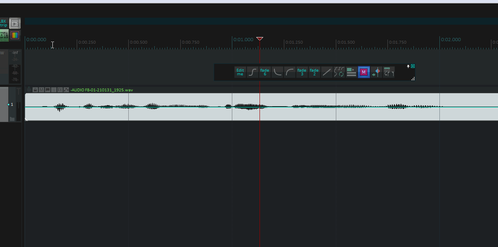
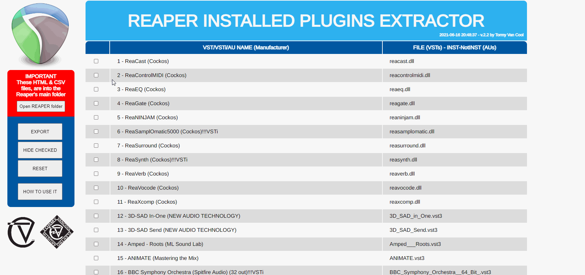

# Tormy Van Cool ReaPack Scripts

If this project was useful to you for your porjects and saved you time, please pay me a drink

Scripts for Reaper
------------------
here you can find some script for Podcasting, Broadcasting and Music Production, helping to expedite some specific workflow.

Copy and paste the following link in Reaper:

_Extensions > ReaPack > Import repositories..._

* https://github.com/tormyvancool/TormyVanCool_ReaPack_Scripts/raw/master/index.xml

Warning
-------
To install the Podcast/Audiobook scripts, this library is mandatory. Please install it and activate it first.
* https://github.com/Ultraschall/ultraschall-lua-api-for-reaper/raw/master/ultraschall_api_index.xml

To activate it:

_Actions > Script: ultraschall_Add_Developertools_To_Reaper.lua > Run/Close_

Export Stems
-------
It exports the stems to the max length of the track or to the max duration of the applied FX whichever occurs first.
This saves space on the HD.
Suppose indeed that in a 4 minute long song, a couple of instruments, are present only in the first 30 seconds.
From that moment on, if exported as usual, you will have a bunch of silence saved on files.
With this script, you save that space.
The instruments are exported from the beginning of the project, till the very end of their track or FX tail whichever occurs first.

ChapterMarkers in function:
-------

VSTs-VSTis-Extractor (and AU/LV2) in function:
-------

EXPORT DATA in function
-------
(Internet connection is mandatory with)

Podcasts_Songs (former ChapterRegions) in function (Video):
-------
Click on the image to watch the video Tutorial

Program_Runner in function (Video Tutorial. Click on the image here below):
-------
Click on the image to watch the video Tutorial

